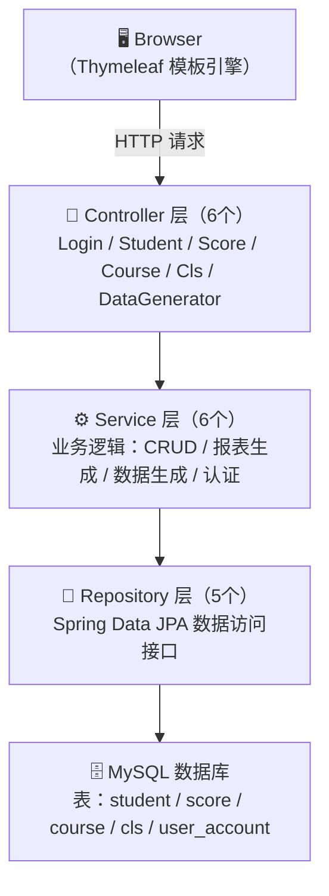

# 🎓 学生成绩管理系统 — 个人技术博客

> **作者**：曹锦文 | **课程**：Java 课程设计 | **项目**：Student Score Management System
>
> 本文档为个人负责模块的技术实现博客，涵盖架构设计、数据库建模、核心业务逻辑、Excel 报表导出、10 万测试数据生成等模块的详细实现过程。

> 🔗 **团队博客地址**：[qlu_java_project](https://github.com/zm2qs5nhks-collab/qlu_java_project)

---

## 📌 一、项目概述

本项目是一个基于 **Spring Boot** 的全栈 Web 应用——学生成绩管理系统，面向高校教务场景，提供学生信息管理、课程管理、成绩录入与查询、学习情况报表生成、成绩分布可视化等核心功能。

本人在项目中承担**全栈开发**角色，负责以下模块：

| 负责模块 | 说明 |
|:---------|:-----|
| 项目架构设计 | Spring Boot 三层架构搭建、Maven 依赖管理 |
| 数据库设计 | 5 张表的 JPA 实体建模、关联关系设计 |
| 后端接口开发 | 6 个 Controller + 6 个 Service 的完整实现 |
| 前端模板开发 | 14 个 Thymeleaf 模板页面的开发 |
| POI Excel 导出 | 原始成绩导出 + 报表级 Excel（含样式） |
| 10 万测试数据生成 | 正态分布成绩 + 批量写入优化 |
| 登录拦截器 | Session 认证 + 全局拦截 |
| 系统部署与联调 | application.properties 配置、项目启动与测试 |

---

## 🏗 二、项目架构设计

### 2.1 三层架构设计

采用经典的 **Controller → Service → Repository** 三层分层架构：



### 2.2 设计思路

- **职责分离**：Controller 仅负责请求路由和视图渲染，不包含业务逻辑。Service 承载全部业务逻辑，是系统的核心。Repository 通过 Spring Data JPA 接口自动生成 CRUD SQL，开发者只需声明方法签名即可。
- **扩展性**：新增功能只需在对应层添加类（如新增一个`ExportController`），不修改已有代码，符合开闭原则。
- **事务管理**：在 Service 层使用 `@Transactional` 注解声明事务边界。例如删除学生时，先删成绩再删学生，两步操作要么全部成功要么全部回滚，保证数据一致性。

### 2.3 Maven 依赖管理

`pom.xml` 核心依赖选型：

| 依赖 | 作用 |
|:-----|:-----|
| `spring-boot-starter-data-jpa` | ORM 持久化框架，包含 Hibernate 实现 |
| `spring-boot-starter-thymeleaf` | 服务端模板引擎，替代 JSP |
| `spring-boot-starter-webmvc` | Web MVC 框架，提供 Controller、拦截器等 |
| `mysql-connector-j` | MySQL 8.0 JDBC 驱动 |
| `lombok` | 编译期自动生成 Getter/Setter/构造器，减少样板代码 |
| `poi` + `poi-ooxml` (5.2.5) | Apache POI，用于读写 .xlsx 格式 Excel 文件 |

---

## 🗄 三、数据库设计

### 3.1 实体关系设计（ER 模型）

系统共设计 **5 张核心数据表**，实体间关系如下：

```
Student (学生)  ──ManyToOne──▶  Cls (班级)
     │
     │ OneToMany (隐式，不声明但逻辑存在)
     ▼
Score (成绩)  ──ManyToOne──▶  Course (课程)
                                │
UserAccount (用户) — 独立实体，用于登录认证，不参与业务关联
```

**关系说明**：
- **Student → Cls**：多个学生属于一个班级（`@ManyToOne`），外键 `cls_id` 建在 Student 表
- **Score → Student**：多条成绩属于一个学生，Score 表通过 `student_id` 外键关联
- **Score → Course**：多条成绩属于一门课程，Score 表通过 `course_id` 外键关联
- 学生删除 → 成绩级联删除（在 Service 层用 `@Transactional` 手写逻辑控制，而非数据库 CASCADE，更加灵活可控）

### 3.2 Student 实体 — 学生表

```java
@Entity  // @Entity: 标记为 JPA 实体类，框架会自动将此类的字段映射为数据库表的列
@Table(name = "student",           // @Table: 自定义表名为 "student"
       uniqueConstraints = {
           @UniqueConstraint(columnNames = "student_no")
           // @UniqueConstraint: 在数据库层面创建 UNIQUE 索引
           // 确保 student_no 列的值在整个表中不重复
           // 这是一种"最后防线"——即使应用层逻辑出错，数据库也会拒绝重复数据
       })
public class Student {
    @Id  // @Id: 声明此字段为主键
    @GeneratedValue(strategy = GenerationType.IDENTITY)
    // GenerationType.IDENTITY: 主键自增策略
    // 插入新行时由数据库自动分配 id 值（MySQL 的 AUTO_INCREMENT）
    // 这比 SEQUENCE 策略更简单直接，适合中小型系统
    private Integer id;

    @Column(name = "student_no", unique = true, nullable = false)
    // unique = true: 与 @UniqueConstraint 配合，双重保证学号唯一性
    // nullable = false: 设置数据库列为 NOT NULL，不允许空值
    private String studentNo;  // 自动生成的 8 位学号，格式如 20260001

    private String name;
    private String gender;
    private LocalDate birthday;  // LocalDate: Java 8 日期类型，仅存年月日，语义比 Date 更清晰

    @ManyToOne  // 多对一关系：多个学生属于一个班级
    @JoinColumn(name = "cls_id")
    // @JoinColumn: 在 student 表中创建 cls_id 外键列，指向 cls 表的主键
    // Hibernate 生成的 DDL: FOREIGN KEY (cls_id) REFERENCES cls(id)
    // 查询时可用 student.getCls().getName() 直接获取班级名，无需手写 JOIN
    private Cls cls;
}
```

**设计要点**：
- 使用 `@UniqueConstraint` 从数据库层面保证学号唯一，应用层通过 `generateStudentNo()` 自动递增生成
- 学号格式 `20260001` 起始：前4位为入学年份，后4位为流水号，语义明确
- `@ManyToOne` 建立外键关系后，JPA 查询时可使用 `student.getCls().getName()` 获取关联班级名

### 3.3 Score 实体 — 成绩表

```java
@Entity
@Table(name = "score")
public class Score {
    @Id
    @GeneratedValue(strategy = GenerationType.IDENTITY)  // 主键自增，与 Student 相同策略
    private Integer id;

    private Float score;  // 使用 Float（而非 Double）：
                          // 成绩只需一位小数精度的浮点数（如 85.5），
                          // Float 占 4 字节，Double 占 8 字节，用 Float 节省存储空间

    @ManyToOne
    @JoinColumn(name = "student_id")
    private Student student;
    // 关联学生实体，Hibernate 会生成 student_id 外键列
    // 查询时：score.getStudent().getName() 可直接拿到学生姓名

    @ManyToOne
    @JoinColumn(name = "course_id")
    private Course course;
    // 关联课程实体，Hibernate 会生成 course_id 外键列
    // 查询时：score.getCourse().getName() 可直接拿到课程名称
}
```

**设计要点**：
- 通过两个 `@ManyToOne` 将 Score 表与 Student 表和 Course 表关联，形成"哪个学生在哪门课考了多少分"的三元语义
- 学生删除时，在 Service 层通过 `@Transactional` 先删成绩再删学生，手动控制级联顺序

### 3.4 Course / Cls / UserAccount 实体

- **Course**：`name`（课程名）+ `credit`（学分），系统启动时确保"数学"、"Java"、"体育"三门课程存在
- **Cls**：`name`（班级名），学生通过下拉框选择归属班级
- **UserAccount**：`username`（唯一）+ `password` + `role`，用于 Session 认证

### 3.5 JPA 配置

```properties
spring.jpa.hibernate.ddl-auto=update   # 自动建表/更新表结构
                                        # update 模式：新增的实体字段会自动新增列
                                        # 但不会删除已有列（安全策略，避免数据丢失）
spring.jpa.show-sql=true               # 控制台打印 SQL，开发阶段便于调试
spring.jpa.properties.hibernate.format_sql=true   # 格式化 SQL 输出，更易读
spring.jpa.open-in-view=false          # 关闭 OSIV（Open Session In View）
                                        # 避免数据库连接持有到视图渲染完成才释放
                                        # 在高并发下可显著减少数据库连接占用
```

---

## ⚙ 四、后端核心模块实现

### 4.1 登录拦截器（LoginInterceptor + WebConfig）

这是系统的**安全基座**。实现原理：利用 Spring MVC 的拦截器机制，在每一个 HTTP 请求到达 Controller 之前检查 Session 中是否有登录用户。

**LoginInterceptor 实现**：

```java
public class LoginInterceptor implements HandlerInterceptor {
    // HandlerInterceptor 是 Spring MVC 的核心拦截器接口
    // preHandle: 在请求到达 Controller 之前执行
    // postHandle: 在 Controller 执行后、视图渲染前执行
    // afterCompletion: 在视图渲染完成后执行（用于资源清理）

    @Override
    public boolean preHandle(HttpServletRequest request,
                             HttpServletResponse response,
                             Object handler) throws Exception {
        HttpSession session = request.getSession();
        // getSession(): 获取当前请求的 Session，如果不存在则自动创建
        // 每个浏览器用户分配唯一 Session（通过 Cookie 中的 JSESSIONID 追踪）

        if (session.getAttribute("user") == null) {
            // getAttribute("user"): 从 Session 中取出之前登录时存入的用户对象
            // 为 null 说明未登录或 Session 已过期
            response.sendRedirect("/");
            // sendRedirect: 302 重定向，浏览器会向 "/" 发起新请求
            return false;
            // return false: 拦截请求，不再继续执行后续拦截器和 Controller
        }
        return true;
        // return true: 放行请求，正常执行 Controller
    }
}
```

**WebConfig 注册拦截器**：

```java
@Configuration  // @Configuration: Spring 配置类，相当于 XML 配置的 Java 写法
public class WebConfig implements WebMvcConfigurer {
    // WebMvcConfigurer: Spring MVC 的配置接口，用于自定义 MVC 行为

    @Override
    public void addInterceptors(InterceptorRegistry registry) {
        // InterceptorRegistry: 拦截器注册表，管理所有拦截器的生效规则

        registry.addInterceptor(new LoginInterceptor())
                // addInterceptor: 注册一个拦截器实例
                .addPathPatterns("/**")
                // addPathPatterns: 设置拦截范围
                // "/**" 表示拦截所有 URL 路径（包括 /student/list, /score/report 等）
                .excludePathPatterns("/", "/login", "/logout",
                                     "/css/**", "/js/**", "/images/**");
                // excludePathPatterns: 排除不需要拦截的路径
                // 必须放行 / 和 /login，否则未登录用户无法访问登录页，形成死循环
                // 放行静态资源 /css、/js、/images，避免拦截器处理这些请求降低性能
    }
}
```

**设计思路**：
- 拦截器链的执行顺序：`preHandle` → `Controller` → `postHandle` → `afterCompletion`
- 本拦截器只在 `preHandle` 阶段生效，逻辑简单明确
- 放行登录页面和静态资源至关重要：如果连登录页都被拦截，用户永远无法登录

### 4.2 学生管理模块（StudentService）

核心功能：学号自动生成、新增/编辑安全处理、级联删除。

**学号自动生成算法**：

```java
public String generateStudentNo() {
    // Step 1: 调用自定义 JPQL 查询，获取数据库中最大的学号
    String maxNo = studentRepo.findMaxStudentNo();
    // findMaxStudentNo() 对应的 SQL:
    //   SELECT MAX(s.studentNo) FROM Student s
    // 返回结果如 "20260042"，表示当前最大的学号

    // Step 2: 处理空表情况（数据库中还没有任何学生记录）
    if (maxNo == null) {
        return "20260001";  // 从 20260001 开始编号
    }

    // Step 3: 截取学号的后 4 位数字并 +1
    int num = Integer.parseInt(maxNo.substring(4)) + 1;
    // 例如 maxNo = "20260042"
    //   maxNo.substring(4) → "0042"
    //   Integer.parseInt("0042") → 42
    //   42 + 1 → 43

    // Step 4: 格式化为 8 位学号（前4位固定2026，后4位补零）
    return "2026" + String.format("%04d", num);
    // String.format("%04d", 43) → "0043"
    // 最终结果: "20260043"
    // "%04d" 的含义: 宽度4位、不足补0的十进制整数
}
```

**新增/修改的安全处理**：

```java
public Student save(Student student) {
    if (student.getId() == null) {
        // 新增操作判断依据: id 为 null
        // 因为 id 使用 @GeneratedValue 自增，保存之前尚未分配数据库 id
        // 此时自动生成新的学号
        student.setStudentNo(generateStudentNo());
    } else {
        // 编辑操作: id 不为 null，说明数据库中已存在该记录
        // 从数据库查出原记录，用原有学号覆盖前端传来的学号
        // 这样即使用户通过浏览器开发者工具修改了学号，后端也会强制纠正
        Student oldStudent = studentRepo.findById(student.getId()).get();
        student.setStudentNo(oldStudent.getStudentNo());
        // ★ 安全策略: 前端 disabled + 后端强制覆盖 = 双重保险
    }
    return studentRepo.save(student);
    // save() 的双重语义:
    //   若 id 为 null → 执行 INSERT
    //   若 id 不为 null → 执行 UPDATE
    // 这是 JPA 的核心设计: 通过 id 是否存在来判断新增还是修改
}
```

**级联删除**：

```java
@Transactional  // 声明事务: 方法内的所有数据库操作要么全部成功，要么全部回滚
                // 如果 deleteById 失败，deleteByStudentId 的操作也会撤销
public void delete(Integer id) {
    scoreRepo.deleteByStudentId(id);  // Step 1: 先删除该学生的所有成绩记录
                                      // 对应 SQL: DELETE FROM score WHERE student_id = ?
    studentRepo.deleteById(id);       // Step 2: 再删除学生本身
                                      // 对应 SQL: DELETE FROM student WHERE id = ?
}
// 为什么不用数据库 CASCADE？
// 手动控制级联顺序更灵活: 可以加日志、可以触发其他业务逻辑
// 数据库 CASCADE 是隐式的，开发者容易忽略其影响，可能导致意外数据丢失
```

### 4.3 成绩管理模块（ScoreService）

**批量录入实现**：

```java
public void saveBatch(Integer courseId, List<Integer> studentIds,
                      List<Float> scores) {
    // 三个参数来自前端表单:
    //   courseId: 当前批量的课程（如"数学"）
    //   studentIds: 所有学生的 ID 列表
    //   scores: 与 studentIds 一一对应的成绩列表

    for (int i = 0; i < studentIds.size(); i++) {
        Float scoreValue = scores.get(i);
        if (scoreValue == null) continue;  // 如果该学生未填分，跳过不处理

        // 查询该学生在这门课上是否已有成绩记录
        Optional<Score> exist = scoreRepo.findByStudentIdAndCourseId(
            studentIds.get(i), courseId);
        // 对应的 SQL: SELECT * FROM score
        //             WHERE student_id = ? AND course_id = ?

        Score score;
        if (exist.isPresent()) {
            score = exist.get();         // 已有成绩 → 拿到旧记录，准备更新分数
        } else {
            score = new Score();         // 没有成绩 → 创建新记录
            // getReferenceById() 与 findById() 的区别:
            //   getReferenceById 返回一个代理对象（懒加载），不立即查询数据库
            //   只有在真正访问代理对象的属性时才会发 SQL
            //   这里只需要设置外键关联，不需要加载完整对象，用代理更高效
            score.setStudent(studentRepo.getReferenceById(studentIds.get(i)));
            score.setCourse(courseRepo.getReferenceById(courseId));
        }
        score.setScore(scoreValue);      // 设置分数
        scoreRepo.save(score);           // 保存（INSERT 或 UPDATE）
    }
}
// 整体逻辑就是"INSERT OR UPDATE"语义，一条 SQL 解决新增/编辑的判断
```

**成绩分数段分布统计**：

```java
public Map<String, Long> getScoreDistribution(Integer courseId) {
    // 根据 courseId 决定统计范围
    List<Score> list = (courseId != null)
        ? scoreRepo.findByCourseId(courseId)   // 只统计指定课程
        : getAll();                             // 统计所有课程

    Map<String, Long> map = new LinkedHashMap<>();
    // LinkedHashMap: 保持插入顺序，前端遍历时分数段按 0~60 → 60~70 → ... → 90~100 展示

    // Java 8 Stream API 实现分段统计:
    // filter(): 筛选落入该分数段的成绩
    // count():  返回符合条件的记录数量（返回 long 类型）
    map.put("0~60分",  list.stream().filter(s -> s.getScore() >= 0  && s.getScore() < 60).count());
    map.put("60~70分", list.stream().filter(s -> s.getScore() >= 60 && s.getScore() < 70).count());
    map.put("70~80分", list.stream().filter(s -> s.getScore() >= 70 && s.getScore() < 80).count());
    map.put("80~90分", list.stream().filter(s -> s.getScore() >= 80 && s.getScore() < 90).count());
    map.put("90~100分",list.stream().filter(s -> s.getScore() >= 90 && s.getScore() <= 100).count());
    // 注意: 90~100 边界用 <= 100 而非 < 100，包含满分

    return map;
}
// 返回结果是 Map，前端 Thymeleaf 通过 th:each 遍历，
// 用纯 CSS 绘制柱状图（柱高按每段人数比例计算）
```

---

## 📊 五、学习情况报表模块（ScoreReportService）

### 5.1 ReportRow 数据结构

```java
public static class ReportRow {
    public String studentNo;       // 学号
    public String studentName;     // 姓名
    public String className;       // 班级
    public Map<String, Float> courseScores = new LinkedHashMap<>();
    // courseScores: 课程名 → 该生成绩，例如 {"数学": 85.5, "Java": 92.0, "体育": 78.0}
    public Map<String, Float> courseClassAvgs = new LinkedHashMap<>();
    // courseClassAvgs: 课程名 → 班级/全校均值，用于对比展示
    public float totalScore;       // 三科总分
    public float classTotalAvg;    // 全校总平均分（所有学生的所有成绩均值）
}
```

### 5.2 报表生成逻辑

```java
public List<ReportRow> generateReport() {
    // 一次性加载所有数据到内存，避免在循环中频繁查询数据库
    List<Student> students = studentRepo.findAll();
    List<Course> courses = courseRepo.findAll();
    List<Score> allScores = scoreRepo.findAll();

    // Step 1: 计算每门课程的全校平均分
    Map<Integer, Float> courseAvgMap = new HashMap<>();
    for (Course course : courses) {
        List<Score> courseScores = allScores.stream()
            .filter(s -> s.getCourse().getId().equals(course.getId()))
            // 从所有成绩中筛选出属于当前课程的记录
            .toList();
        double avg = courseScores.stream()
            .mapToDouble(Score::getScore)    // 提取分数转为 DoubleStream
            .average()                        // 终端操作: 计算平均值，返回 OptionalDouble
            .orElse(0);                      // 无成绩时为 0，避免 Optional 空值
        courseAvgMap.put(course.getId(), (float) Math.round(avg * 100) / 100);
        // round(avg * 100) / 100: 保留两位小数
    }

    // Step 2: 计算全校总平均分（所有成绩的平均值）
    double grandTotalAvg = allScores.stream()
        .mapToDouble(Score::getScore)
        .average()
        .orElse(0);
    float classTotalAvg = (float) Math.round(grandTotalAvg * 100) / 100;

    // Step 3: 遍历每个学生，构造报表行
    List<ReportRow> rows = new ArrayList<>();
    for (Student stu : students) {
        ReportRow row = new ReportRow();
        row.studentNo = stu.getStudentNo();
        row.studentName = stu.getName();
        row.className = stu.getCls() != null ? stu.getCls().getName() : "";
        // 处理 cls 为 null 的边界情况（学生可能未分配班级）

        float total = 0;
        for (Course course : courses) {
            // 查找该学生在这门课上的成绩
            Optional<Score> scoreOpt = allScores.stream()
                .filter(s -> s.getStudent().getId().equals(stu.getId())
                          && s.getCourse().getId().equals(course.getId()))
                .findFirst();
            float sc = scoreOpt.map(Score::getScore).orElse(0f);
            row.courseScores.put(course.getName(), sc);
            row.courseClassAvgs.put(course.getName(),
                courseAvgMap.getOrDefault(course.getId(), 0f));
            total += sc;
        }
        row.totalScore = (float) Math.round(total * 100) / 100;
        row.classTotalAvg = classTotalAvg;
        rows.add(row);
    }

    // Step 4: 按总成绩降序排列（从高到低）
    rows.sort((a, b) -> Float.compare(b.totalScore, a.totalScore));
    // Float.compare(b, a): b > a 返回负数，b < a 返回正数
    // 降序的关键是把 b 放在第一个参数位置

    return rows;
}
```

### 5.3 Excel 报表导出（POI 加分项）⭐

```java
public void exportReportExcel(List<ReportRow> rows,
                               HttpServletResponse response) throws Exception {
    // ★ XSSFWorkbook vs HSSFWorkbook:
    //    XSSFWorkbook 处理 .xlsx 格式（Excel 2007+，基于 XML，最大 1048576 行）
    //    HSSFWorkbook 处理 .xls 格式（Excel 97-2003，基于二进制，最大 65536 行）
    //    本项目用 XSSFWorkbook，因 .xlsx 格式现代、兼容性好、容量更大
    Workbook workbook = new XSSFWorkbook();
    Sheet sheet = workbook.createSheet("学习情况报表");

    // ---- 创建表头样式 ----
    CellStyle headerStyle = workbook.createCellStyle();
    // CellStyle: 单元格样式对象，可设置字体、背景色、边框、对齐等
    // 一个 Style 可复用于多个单元格，避免重复创建浪费内存

    Font headerFont = workbook.createFont();
    headerFont.setBold(true);  // 字体加粗
    headerStyle.setFont(headerFont);  // 将字体绑定到样式上

    headerStyle.setFillForegroundColor(IndexedColors.GREY_25_PERCENT.getIndex());
    // 设置前景色（填充色）为 25% 灰色，比纯灰更柔和
    headerStyle.setFillPattern(FillPatternType.SOLID_FOREGROUND);
    // FillPatternType.SOLID_FOREGROUND: 纯色填充
    // ★ 必须先设置 pattern 再设置颜色，否则颜色不生效（POI 的设计要求）

    // ---- 构建表头行 ----
    int col = 0;  // 列索引计数器
    Row headerRow = sheet.createRow(0);  // 第 0 行为表头
    String[] baseHeaders = {"排名", "学号", "姓名", "班级"};
    for (String h : baseHeaders) {
        Cell cell = headerRow.createCell(col++);
        cell.setCellValue(h);
        cell.setCellStyle(headerStyle);  // 复用同一个样式对象
    }
    // 动态课程列: 从报表数据中读取所有课程名
    List<String> courseNames = new ArrayList<>(rows.get(0).courseScores.keySet());
    for (String cn : courseNames) {
        // 每门课程占两列: 成绩 + 班级均值
        Cell cell = headerRow.createCell(col++);
        cell.setCellValue(cn + "成绩");
        cell.setCellStyle(headerStyle);
        cell = headerRow.createCell(col++);
        cell.setCellValue(cn + "均值");
        cell.setCellStyle(headerStyle);
    }
    // 最后两列: 总分 + 总平均
    Cell totalCell = headerRow.createCell(col++);
    totalCell.setCellValue("总分");
    totalCell.setCellStyle(headerStyle);
    Cell avgCell = headerRow.createCell(col++);
    avgCell.setCellValue("总平均分");
    avgCell.setCellStyle(headerStyle);

    // ---- 填充数据行 ----
    int rowNum = 1;  // 从第 1 行开始（第 0 行是表头）
    for (ReportRow row : rows) {
        Row dataRow = sheet.createRow(rowNum++);
        int c = 0;
        dataRow.createCell(c++).setCellValue(rowNum - 1);  // 排名 = 行号，体现降序
        dataRow.createCell(c++).setCellValue(row.studentNo);
        dataRow.createCell(c++).setCellValue(row.studentName);
        dataRow.createCell(c++).setCellValue(row.className);
        for (String cn : courseNames) {
            dataRow.createCell(c++).setCellValue(
                row.courseScores.getOrDefault(cn, 0f));
            dataRow.createCell(c++).setCellValue(
                row.courseClassAvgs.getOrDefault(cn, 0f));
        }
        dataRow.createCell(c++).setCellValue(row.totalScore);
        dataRow.createCell(c++).setCellValue(row.classTotalAvg);
    }

    // ---- 自动列宽 ----
    for (int i = 0; i < col; i++) {
        sheet.autoSizeColumn(i);
        // autoSizeColumn: 根据该列所有单元格内容，自动计算最佳列宽
        // 原理: 遍历该列所有单元格，取最长内容的宽度作为列宽
        // 注意: 数据量大时 autoSizeColumn 会遍历所有行，稍有性能开销
    }

    // ---- 设置 HTTP 响应头（触发浏览器下载） ----
    response.setContentType(
        "application/vnd.openxmlformats-officedocument.spreadsheetml.sheet");
    // ★ MIME 类型告诉浏览器这是一个 .xlsx 文件，浏览器会自动下载

    String fileName = URLEncoder.encode("学习情况报表.xlsx", "UTF-8");
    // URLEncoder: 处理中文文件名，避免浏览器无法识别
    // 不编码的话 "学习情况报表.xlsx" 在 Response Header 中会变成乱码

    response.setHeader("Content-Disposition",
        "attachment;filename=" + fileName);
    // Content-Disposition: attachment → 浏览器下载文件
    //                      inline    → 浏览器内预览

    OutputStream os = response.getOutputStream();
    workbook.write(os);   // 将 Excel 内容写入 HTTP 响应输出流
    os.flush();           // 强制刷新缓冲区，确保所有数据发送
    os.close();
    workbook.close();     // 关闭工作簿，释放 POI 内部资源
}
```

---

## 🎲 六、10 万测试数据生成（DataGeneratorService）⭐

### 6.1 正态分布成绩生成

```java
// 正态分布成绩生成: 均值 mean=80，标准差 stdDev=10
float mathScore = (float) Math.round(
    clampScore(mean + random.nextGaussian() * stdDev) * 10
) / 10;

// 逐层拆解:
// random.nextGaussian() → 生成标准正态分布 N(0, 1) 的随机数
//   约 68% 的值落在 [-1, 1] 之间
//   约 95% 的值落在 [-2, 2] 之间
//   约 99.7% 的值落在 [-3, 3] 之间（三西格玛原则）
//
// mean + z * stdDev → 线性变换到 N(80, 100) 分布
//   当 z=1  →  80+10=90 分（前 16%）
//   当 z=0  →  80 分（平均值，约占 68% 的学生在 70~90 之间）
//   当 z=-1 →  80-10=70 分（后 16%）
//
// clampScore(result) → 裁剪到 [0, 100] 范围内
//   虽然 N(80,100) 超出 0~100 的概率很小（约 2.3%），
//   但不能让成绩出现负数或超过 100，需要手动修正
//
// Math.round(result * 10) / 10 → 保留一位小数
//   例: 85.67 → 856.7 → Math.round → 857 → 85.7

// 裁剪函数: 将成绩限制在 0~100 范围内
private double clampScore(double score) {
    return Math.max(0, Math.min(100, score));
    // Math.min(100, score): 取 score 和 100 中的较小值（上限 100）
    // Math.max(0, ...):      取结果和 0 中的较大值（下限 0）
    // 例如 clampScore(105) → Math.min(100, 105)=100 → Math.max(0, 100)=100
    // 例如 clampScore(-5)  → Math.min(100, -5)=-5  → Math.max(0, -5)=0
}
```

### 6.2 姓名随机生成

```java
// 素材库: 20 个姓 × 40 个名 = 800 种组合
// 对于 10 万学生来说，会有重复姓名，这符合中国实际情况
private static final String[] SURNAMES = {
    "张", "李", "王", "刘", "陈", "杨", "赵", "黄", "周", "吴",
    "徐", "孙", "胡", "朱", "高", "林", "何", "郭", "马", "罗"
};
private static final String[] GIVEN_NAMES = {
    "伟", "芳", "娜", "秀英", "敏", "静", "丽", "强", "磊", "洋",
    "勇", "艳", "杰", "涛", "明", "超", "秀兰", "霞", "平", "刚",
    "文", "华", "飞", "玉兰", "桂花", "波", "斌", "军", "辉", "玲",
    "建国", "建华", "建军", "志强", "志明", "国强", "国栋", "雪梅", "海燕", "秀珍"
};

private String generateName() {
    String surname = SURNAMES[random.nextInt(SURNAMES.length)];
    // random.nextInt(n): 生成 [0, n) 区间内的随机整数
    // 20 个姓，索引范围 0~19

    String given = GIVEN_NAMES[random.nextInt(GIVEN_NAMES.length)];
    // 40 个名，索引范围 0~39

    return surname + given;  // 拼接姓+名，如 "张伟"、"李建国"
}
```

### 6.3 批量写入优化（核心性能策略）

```java
// 预分配容量的 ArrayList，避免动态扩容带来的性能损耗
List<Student> studentBatch = new ArrayList<>(1000);
// 初始容量 1000: 保证在 1000 条内不会触发 ArrayList 扩容（默认容量 10）
// ArrayList 扩容机制: 每次扩为 1.5 倍，涉及数组拷贝，1000 条数据能避免约 6 次扩容

List<Score> scoreBatch = new ArrayList<>(3000);
// 容量 3000: 1000 个学生 × 3 门课 = 最多 3000 条成绩

for (int i = 0; i < count; i++) {
    // ... 生成单个学生和三科成绩 ...

    studentBatch.add(student);
    // 每生成一个学生就加入批次列表

    if (studentBatch.size() >= 1000) {
        // ★ 批量插入的临界点: 攒够 1000 条统一写入
        // 为什么是 1000 而不是更大?
        //   - 太小(如100): 数据库往返次数多，性能下降
        //   - 太大(如10000): 单次事务过长，内存占用大，容易 OOM
        //   - 1000 是一个经验平衡点

        studentRepo.saveAll(studentBatch);
        // saveAll 对应一条批量 INSERT:
        //   INSERT INTO student (name, gender, ...) VALUES
        //     (?, ?, ...), (?, ?, ...), ... (共 1000 组参数)
        // 比 1000 次单独的 save 快数十倍，因为只有 1 次数据库网络往返

        // 为这批学生创建成绩...
        scoreRepo.saveAll(scoreBatch);

        totalInserted += studentBatch.size();
        studentBatch.clear();   // 清空缓冲区，准备下一批
        scoreBatch.clear();
        // clear() 不释放底层数组，只是把 size 归零，内存复用

        System.out.println("数据库已插入 " + totalInserted + " / " + count);
        // 进度日志: 让用户知道系统在正常工作，不是卡死了
    }
}

// ★ 处理最后一批不足 1000 条的剩余数据
if (insertToDb && !studentBatch.isEmpty()) {
    studentRepo.saveAll(studentBatch);
    // ... 创建成绩 ...
    scoreRepo.saveAll(scoreBatch);
}
```

### 6.4 性能优化策略总结

| 优化点 | 实现方式 | 原理 |
|:-------|:---------|:-----|
| **批量保存** | 每 1000 条 `saveAll` 一次 | 减少数据库网络往返次数（1000 次 → 1 次） |
| **预加载课程** | 一次 `findAll` 缓存到 Map | 避免循环中每次 `courseRepo.findByName()` 查库 |
| **ArrayList 预分配** | `new ArrayList<>(1000)` | 避免扩容时的数组拷贝开销 |
| **缓冲区复用** | `clear()` 而非 `new ArrayList()` | 复用已分配的内存，减少 GC 压力 |
| **文件缓冲写入** | 每 1 万条 `flush()` 一次 | 平衡内存占用与 I/O 次数 |
| **进度日志** | 每批打印进度 | 提升用户体验，便于排查性能瓶颈 |
| **懒加载外键** | `getReferenceById()` | 不查询数据库，仅返回代理对象设置外键 |

---

## 🖥 七、前端模板开发（Thymeleaf）

本系统共开发 **14 个 Thymeleaf 模板页面**，涵盖全部功能模块：

| 分类 | 模板文件 | 功能 |
|:-----|:---------|:-----|
| 认证 | `login.html` | 登录表单（用户名 + 密码 + 错误提示） |
| 导航 | `index.html` | 系统首页，按模块分类的功能导航 |
| 学生管理 | `studentList.html`、`addStudent.html` | 列表展示 + 新增/编辑共用表单 |
| 成绩管理 | `scoreList.html`、`addScore.html`、`addScoreBatch.html` | 成绩列表搜索 + 单条录入 + 批量录入 |
| 课程管理 | `courseList.html`、`addCourse.html` | 课程的增删改查 |
| 班级管理 | `classList.html`、`addClass.html` | 班级的增删改查 |
| 统计报表 | `scoreReport.html` | 学习情况报表表格展示 + 导出按钮 |
| 可视化 | `scoreDistribution.html` | CSS 纯柱状图展示成绩分布 |
| 测试工具 | `dataGenerator.html` | 数据生成参数配置表单 |

**Thymeleaf 关键技术**：

| 语法 | 用途 | 示例 |
|:-----|:-----|:-----|
| `th:each` | 列表遍历渲染 | `<tr th:each="stu : ${studentList}">` 遍历学生列表 |
| `th:if` / `th:unless` | 条件显示 | `<span th:if="${msg != null}">` 有消息才显示提示 |
| `th:text` | 文本内容输出 | `<td th:text="${stu.name}">` 输出学生姓名 |
| `th:field` | 表单双向绑定 | `<input th:field="*{name}">` 绑定对象属性 |
| `th:action` | 表单提交地址 | `<form th:action="@{/student/save}">` |
| `th:href` | 超链接路径 | `<a th:href="@{/student/list}">` 上下文相对路径 |

**安全性设计**：编辑页面中学号输入框设置 `disabled` 属性（前端不可改），同时后端 `save()` 方法强制用数据库原值覆盖（后端不可绕过），形成"双重保险"。

---

## 🔐 八、登录认证实现

**完整登录流程**：

```
[浏览器]  用户输入 username + password
    │
    │  POST /login
    ▼
[LoginController]
    │  接收 @RequestParam username, password
    │
    ▼
[UserAccountService]
    │  调用 findUserByUsername(username)
    │  → 查数据库 user_account 表
    │  → 返回 Optional<UserAccount>
    │
    ▼
[LoginController]
    │  判断: user.isPresent() && password.equals(user.get().getPassword())
    │
    ├── [验证失败] → model.addAttribute("msg", "账号或密码错误")
    │                → 返回 login.html，重新显示登录页 + 红色错误提示
    │
    └── [验证成功] → session.setAttribute("user", user.get())
                    → redirect:/index
                    → Session 中存入用户对象，后续请求通过拦截器自动识别
```

**退出流程**：

```
[浏览器]  点击"退出登录"
    │
    │  GET /logout
    ▼
[LoginController]
    │  session.invalidate()
    │  ★ invalidate() 会销毁当前 Session 中的所有数据
    │    包括 "user" 属性，意味着用户认证状态完全清除
    │
    │  redirect:/
    ▼
[浏览器]  返回登录页，无法再访问任何业务页面
```

---

## 🚀 九、系统配置与部署

### application.properties 关键配置

```properties
# ========== 数据库连接 ==========
spring.datasource.url=jdbc:mysql://127.0.0.1:3306/student_db
# jdbc:mysql:// → MySQL JDBC 协议
# 127.0.0.1:3306  → 本机 MySQL 默认端口
# /student_db    → 目标数据库名

spring.datasource.username=root
spring.datasource.password=***
spring.datasource.driver-class-name=com.mysql.cj.jdbc.Driver
# com.mysql.cj.jdbc.Driver 是 MySQL 8.0 的驱动类
# MySQL 5.x 使用的是 com.mysql.jdbc.Driver（已废弃）

# ========== JPA / Hibernate ==========
spring.jpa.hibernate.ddl-auto=update
# update 模式: 启动时自动比对实体与表结构
#   新增实体/字段 → 自动添加列
#   删除字段     → 不会删列（安全策略，防止误删数据）
#   生产环境建议用 validate（只校验不修改）

spring.jpa.show-sql=true
# 在控制台打印每条 SQL 语句，开发调试必备
# 输出示例: Hibernate: select s1_0.id,s1_0.name from student s1_0

spring.jpa.properties.hibernate.format_sql=true  # 格式化 SQL 输出
spring.jpa.open-in-view=false
# 关闭 Open Session In View
# OSIV 默认开启，会把 Session 生命周期延长到视图渲染阶段
# 关闭后 Session 在 Service 层结束后立即释放，减少数据库连接占用时间

# ========== Thymeleaf ==========
spring.thymeleaf.cache=false
# 开发阶段关闭模板缓存，修改 HTML 后刷新浏览器即可看到效果
# 生产环境应设为 true 提升性能

# ========== 服务器 ==========
server.port=8080  # 默认 Web 端口
```

### 启动方式

```bash
# 方式 1：Maven Wrapper（推荐，无需全局安装 Maven）
# mvnw 是项目内置的 Maven 包装器脚本，自动下载匹配的 Maven 版本
./mvnw spring-boot:run

# 方式 2：系统 Maven
mvn spring-boot:run

# 方式 3：打包成 JAR 运行（适合部署）
mvn clean package -DskipTests
# clean:  清空 target 目录
# package: 编译 + 打包为 JAR
# -DskipTests: 跳过单元测试（加速构建）
java -jar target/student_score-0.0.1-SNAPSHOT.jar
# Spring Boot 内嵌 Tomcat，JAR 可直接运行，无需部署到外部 Tomcat
```

---

## 🎯 十、总结与收获

通过本次课程设计，我在以下方面获得了深入的实践锻炼：

### 1. Spring Boot 全栈开发能力
从零搭建项目、配置 Maven 依赖、设计三层架构到开发完整的 CRUD 功能，完整走通了 Spring Boot 项目的开发全流程。理解了 IOC 容器如何管理 Bean、`@Autowired` 依赖注入的工作原理。

### 2. JPA 数据持久化
深入掌握了 `@Entity` 实体映射、`@ManyToOne` 多对一关联、`@UniqueConstraint` 数据库约束等 JPA 核心注解。理解了 `getReferenceById()`（懒加载代理）与 `findById()`（立即查库）的性能差异，以及 `@Transactional` 事务边界的设计原则。

### 3. 算法思维在业务中的应用
- 学号自增生成：字符串截取 + 格式化补零
- 正态分布成绩：`nextGaussian()` 标准正态 → 线性变换 N(80, 100) → 边界裁剪
- 批量分片：将 10 万数据拆分为 1000 条一批，平衡内存与网络开销

### 4. Apache POI 实战
从零学习 POI API，完成了带表头样式、自动列宽、动态课程列、排名列、中文文件名支持的 Excel 报表导出。理解了 `XSSFWorkbook`（.xlsx）与 `HSSFWorkbook`（.xls）的核心区别。

### 5. 性能优化意识
在 10 万数据生成模块中，通过批量保存（batch size = 1000）、ArrayList 预分配容量、`getReferenceById()` 懒加载、文件缓冲写入等手段，将生成时间控制在秒级。

### 6. 前后端协同
Thymeleaf 模板中灵活运用 `th:each`、`th:if`、`th:field` 等动态标签。前端 `disabled` 禁用学号输入 + 后端 `save()` 强制覆盖的"双重保险"策略，体现了 Web 安全中"永远不信任客户端"的原则。

### 7. Web 安全基础
实现了 Session 认证 + `HandlerInterceptor` 全局拦截器模式。理解了无状态 HTTP 如何通过 Cookie + Session 实现有状态认证，以及拦截器链的执行顺序。

---

> 📅 **最后更新**：2026年6月26日
> ✍️ **作者**：曹锦文
> 🏫 **齐鲁工业大学（QLU）** | 计科（拔尖）25-1
