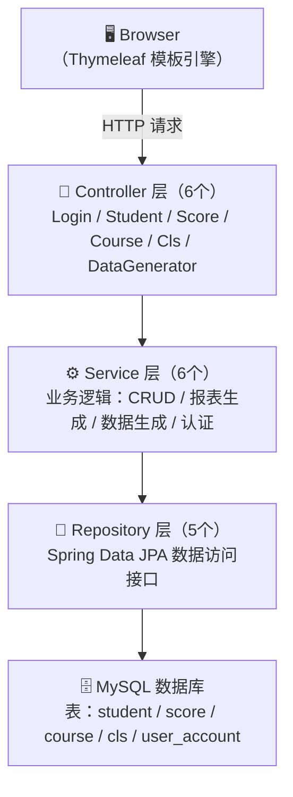

# 🎓 学生成绩管理系统 — 个人技术博客

> **作者**：曹锦文 | **课程**：Java 课程设计 | **项目**：Student Score Management System
>
> 本文档为个人负责模块的技术实现博客，涵盖架构设计、数据库建模、核心业务逻辑、Excel 报表导出、10 万测试数据生成等模块的详细实现过程。

---

## 📌 一、项目概述

本项目是一个基于 **Spring Boot** 的全栈 Web 应用——学生成绩管理系统，面向高校教务场景，提供学生信息管理、课程管理、成绩录入与查询、学习情况报表生成、成绩分布可视化等核心功能。

本人在项目中承担**全栈开发**角色，负责以下模块：

| 负责模块 | 说明 |
|:---------|:-----|
| 项目架构设计 | Spring Boot 三层架构搭建、Maven 依赖管理 |
| 数据库设计 | 5 张表的 JPA 实体建模、关联关系设计 |
| 后端接口开发 | 6 个 Controller + 6 个 Service 的完整实现 |
| 前端模板开发 | 14 个 Thymeleaf 模板页面的开发 |
| POI Excel 导出 | 原始成绩导出 + 报表级 Excel（含样式） |
| 10 万测试数据生成 | 正态分布成绩 + 批量写入优化 |
| 登录拦截器 | Session 认证 + 全局拦截 |
| 系统部署与联调 | application.properties 配置、项目启动与测试 |

> 🔗 **团队博客地址**：[qlu_java_project](https://github.com/zm2qs5nhks-collab/qlu_java_project)

---

## 🏗 二、项目架构设计

### 2.1 三层架构设计

采用经典的 **Controller → Service → Repository** 三层分层架构：



### 2.2 设计思路

- **职责分离**：Controller 仅负责请求路由和视图渲染，Service 承载全部业务逻辑，Repository 通过 Spring Data JPA 自动生成 CRUD 操作
- **扩展性**：新增功能只需增加对应层的类，不影响已有代码
- **事务管理**：在 Service 层使用 `@Transactional` 注解保证数据一致性（如删除学生时级联删除成绩）

### 2.3 Maven 依赖管理

`pom.xml` 核心依赖选型：

| 依赖 | 作用 |
|:-----|:-----|
| `spring-boot-starter-data-jpa` | ORM 持久化框架 |
| `spring-boot-starter-thymeleaf` | 服务端模板渲染 |
| `spring-boot-starter-webmvc` | Web MVC 框架 |
| `mysql-connector-j` | MySQL 数据库驱动 |
| `lombok` | 简化实体类样板代码 |
| `poi` + `poi-ooxml` (5.2.5) | Excel 读写操作 |

---

## 🗄 三、数据库设计

### 3.1 实体关系设计（ER 模型）

系统共设计 **5 张核心数据表**，实体间关系如下：

```
Student (学生)  ──ManyToOne──▶  Cls (班级)
     │
     │ OneToMany (隐式)
     ▼
Score (成绩)  ──ManyToOne──▶  Course (课程)
                                │
UserAccount (用户) — 独立实体，用于登录认证
```

### 3.2 Student 实体 — 学生表

```java
@Entity
@Table(name = "student", uniqueConstraints = {
    @UniqueConstraint(columnNames = "student_no")  // 学号唯一约束
})
public class Student {
    @Id
    @GeneratedValue(strategy = GenerationType.IDENTITY)
    private Integer id;

    @Column(name = "student_no", unique = true, nullable = false)
    private String studentNo;  // 自动生成，格式 20260001

    private String name;
    private String gender;
    private LocalDate birthday;

    @ManyToOne
    @JoinColumn(name = "cls_id")
    private Cls cls;  // 多对一关联班级
}
```

**设计要点**：
- 使用 `@UniqueConstraint` 在数据库层面保证学号唯一性，应用层同时通过 `generateStudentNo()` 方法自动递增生成
- 学号格式 `20260001` 起始，截取后 4 位自增，新增时自动生成，编辑时前端禁用输入框 + 后端强制覆盖防止篡改
- `@ManyToOne` 建立学生与班级的多对一关系，外键为 `cls_id`

### 3.3 Score 实体 — 成绩表

```java
@Entity
@Table(name = "score")
public class Score {
    @Id
    @GeneratedValue(strategy = GenerationType.IDENTITY)
    private Integer id;

    private Float score;  // 使用 Float 保留一位小数精度

    @ManyToOne
    @JoinColumn(name = "student_id")
    private Student student;

    @ManyToOne
    @JoinColumn(name = "course_id")
    private Course course;
}
```

**设计要点**：
- 通过两个 `@ManyToOne` 分别关联学生和课程，实现"哪个学生在哪门课考了多少分"的语义
- 学生删除时，Service 层通过 `@Transactional` 先删除其所有成绩再删学生，保证引用完整性

### 3.4 Course / Cls / UserAccount 实体

- **Course**：课程名 + 学分，系统预置"数学"、"Java"、"体育"三门课程
- **Cls**：班级名，学生归属班级时通过下拉框选择
- **UserAccount**：用户名 + 密码 + 角色，用于登录认证

### 3.5 JPA 配置

```properties
spring.jpa.hibernate.ddl-auto=update   # 自动建表/更新表结构
spring.jpa.show-sql=true               # 开发阶段打印 SQL 便于调试
spring.jpa.properties.hibernate.format_sql=true
spring.jpa.open-in-view=false          # 关闭 OSIV 避免性能问题
```

---

## ⚙ 四、后端核心模块实现

### 4.1 登录拦截器（LoginInterceptor + WebConfig）

这是系统的**安全基座**，实现 Session 认证 + 全局拦截。

**LoginInterceptor 实现**：

```java
public class LoginInterceptor implements HandlerInterceptor {
    @Override
    public boolean preHandle(HttpServletRequest request,
                             HttpServletResponse response,
                             Object handler) throws Exception {
        HttpSession session = request.getSession();
        if (session.getAttribute("user") == null) {
            response.sendRedirect("/");  // 未登录→重定向登录页
            return false;
        }
        return true;
    }
}
```

**WebConfig 注册拦截器**：

```java
@Configuration
public class WebConfig implements WebMvcConfigurer {
    @Override
    public void addInterceptors(InterceptorRegistry registry) {
        registry.addInterceptor(new LoginInterceptor())
                .addPathPatterns("/**")         // 拦截所有请求
                .excludePathPatterns("/", "/login", "/logout",
                                     "/css/**", "/js/**", "/images/**");
    }
}
```

**设计思路**：
- 使用 Spring MVC 的 `HandlerInterceptor` 接口，在请求到达 Controller 之前执行
- 放行登录页面和静态资源，避免死循环重定向
- 登录成功后将 `UserAccount` 对象写入 Session，退出时销毁

### 4.2 学生管理模块（StudentService）

**核心功能**：学号自动生成、姓名模糊搜索、级联删除。

**学号自动生成算法**：

```java
public String generateStudentNo() {
    String maxNo = studentRepo.findMaxStudentNo();  // JPQL 查最大学号
    if (maxNo == null) {
        return "20260001";  // 数据库空表时从 20260001 开始
    }
    int num = Integer.parseInt(maxNo.substring(4)) + 1;  // 截取后4位自增
    return "2026" + String.format("%04d", num);          // 补零保证8位
}
```

**新增/修改的安全处理**：

```java
public Student save(Student student) {
    if (student.getId() == null) {
        student.setStudentNo(generateStudentNo());  // 新增：自动生成学号
    } else {
        Student old = studentRepo.findById(student.getId()).get();
        student.setStudentNo(old.getStudentNo());   // 编辑：强制沿用原学号
    }
    return studentRepo.save(student);
}
```

**级联删除**：

```java
@Transactional
public void delete(Integer id) {
    scoreRepo.deleteByStudentId(id);  // 先删成绩
    studentRepo.deleteById(id);       // 再删学生
}
```

### 4.3 成绩管理模块（ScoreService）

**批量录入实现**：

```java
public void saveBatch(Integer courseId, List<Integer> studentIds,
                      List<Float> scores) {
    for (int i = 0; i < studentIds.size(); i++) {
        Float scoreValue = scores.get(i);
        if (scoreValue == null) continue;  // 未填则跳过

        Optional<Score> exist = scoreRepo.findByStudentIdAndCourseId(
            studentIds.get(i), courseId);
        Score score;
        if (exist.isPresent()) {
            score = exist.get();         // 已有成绩→更新
        } else {
            score = new Score();         // 新成绩→创建
            score.setStudent(studentRepo.getReferenceById(studentIds.get(i)));
            score.setCourse(courseRepo.getReferenceById(courseId));
        }
        score.setScore(scoreValue);
        scoreRepo.save(score);
    }
}
```

**设计要点**：
- 通过 `getReferenceById()` 代替 `findById()`，避免额外的数据库查询
- 已有成绩则更新、无则新增（INSERT OR UPDATE 语义）
- 前端按课程筛选展示所有学生 → 统一填分 → 批量提交

**成绩分数段分布统计**：

```java
public Map<String, Long> getScoreDistribution(Integer courseId) {
    List<Score> list = (courseId != null)
        ? scoreRepo.findByCourseId(courseId) : getAll();

    Map<String, Long> map = new LinkedHashMap<>();
    map.put("0~60分",  list.stream().filter(s -> s.getScore() >= 0  && s.getScore() < 60).count());
    map.put("60~70分", list.stream().filter(s -> s.getScore() >= 60 && s.getScore() < 70).count());
    map.put("70~80分", list.stream().filter(s -> s.getScore() >= 70 && s.getScore() < 80).count());
    map.put("80~90分", list.stream().filter(s -> s.getScore() >= 80 && s.getScore() < 90).count());
    map.put("90~100分",list.stream().filter(s -> s.getScore() >= 90 && s.getScore() <= 100).count());
    return map;
}
```

前端 Thymeleaf 中通过 `th:each` 遍历 `scoreData` Map，用纯 CSS 绘制柱状图（柱高比例于人数）。

---

## 📊 五、学习情况报表模块（ScoreReportService）

### 5.1 报表生成逻辑

```java
public List<ReportRow> generateReport() {
    // 步骤 1：计算每门课程的全校平均分
    for (Course course : courses) {
        double avg = allScores.stream()
            .filter(s -> s.getCourse().getId().equals(course.getId()))
            .mapToDouble(Score::getScore).average().orElse(0);
        courseAvgMap.put(course.getId(), avg);
    }

    // 步骤 2：计算全校总平均分
    double grandTotalAvg = allScores.stream()
        .mapToDouble(Score::getScore).average().orElse(0);

    // 步骤 3：遍历每个学生，构造报表行
    for (Student stu : students) {
        ReportRow row = new ReportRow();
        // 填充各科成绩、班级均值、总分
        ...
        rows.add(row);
    }

    // 步骤 4：按总成绩降序排列
    rows.sort((a, b) -> Float.compare(b.totalScore, a.totalScore));
    return rows;
}
```

### 5.2 TXT 格式导出

使用 `PrintWriter` 格式化输出，定宽列对齐，表头 + 分隔线 + 数据行结构。

### 5.3 Excel 报表导出（POI 加分项）⭐

这是本项目的**核心技术亮点**，使用 Apache POI 生成专业级 Excel 报表：

```java
public void exportReportExcel(List<ReportRow> rows,
                               HttpServletResponse response) throws Exception {
    Workbook workbook = new XSSFWorkbook();  // .xlsx 格式
    Sheet sheet = workbook.createSheet("学习情况报表");

    // 1. 创建表头样式（加粗 + 灰色背景）
    CellStyle headerStyle = workbook.createCellStyle();
    Font headerFont = workbook.createFont();
    headerFont.setBold(true);
    headerStyle.setFont(headerFont);
    headerStyle.setFillForegroundColor(IndexedColors.GREY_25_PERCENT.getIndex());
    headerStyle.setFillPattern(FillPatternType.SOLID_FOREGROUND);

    // 2. 动态构建表头列（排名、学号、姓名、班级、各科成绩+均值、总分、总平均）
    // 3. 填充数据行（排名 = rowNum - 1，依总分降序自动编号）
    // 4. 自动列宽（autoSizeColumn，根据内容自适应）
    for (int i = 0; i < col; i++) {
        sheet.autoSizeColumn(i);
    }

    // 5. 设置浏览器下载响应头
    response.setContentType("application/vnd.openxmlformats...");
    response.setHeader("Content-Disposition",
        "attachment;filename=" + URLEncoder.encode("学习情况报表.xlsx", "UTF-8"));

    workbook.write(response.getOutputStream());
    workbook.close();
}
```

**实现要点**：
- 表头样式：`Font.BOLD` + `GREY_25_PERCENT` 灰底，提升可读性
- 排名列：利用 `rowNum` 自动编号，反映总分降序的排名
- 自动列宽：`sheet.autoSizeColumn(i)` 根据单元格内容自动调整
- 中文文件名：`URLEncoder.encode()` 处理浏览器兼容

---

## 🎲 六、10 万测试数据生成（DataGeneratorService）⭐

这是另一个**核心加分模块**，支持生成符合**正态分布**的大批量测试数据。

### 6.1 正态分布成绩生成

```java
// 正态分布：均值 mean=80，标准差 stdDev=10
float mathScore = (float) Math.round(
    clampScore(mean + random.nextGaussian() * stdDev) * 10
) / 10;

// 裁剪到 0~100 范围
private double clampScore(double score) {
    return Math.max(0, Math.min(100, score));
}
```

**原理说明**：
- `Random.nextGaussian()` 生成标准正态分布 N(0,1)
- 线性变换 `mean + z * stdDev` 得到 N(80, 100) 分布
- `clampScore()` 将极端值裁剪到 [0, 100]，模拟真实考试分数范围
- `Math.round(x * 10) / 10` 保留一位小数

### 6.2 姓名随机生成

```java
// 素材库：20 个姓 × 40 个名 = 800 种组合
private static final String[] SURNAMES = {"张","李","王","刘","陈","杨",...};
private static final String[] GIVEN_NAMES = {"伟","芳","娜","秀英","敏",...};

private String generateName() {
    return SURNAMES[random.nextInt(SURNAMES.length)]
         + GIVEN_NAMES[random.nextInt(GIVEN_NAMES.length)];
}
```

### 6.3 批量写入优化

```java
List<Student> studentBatch = new ArrayList<>(1000);   // 学生批次 1000
List<Score> scoreBatch = new ArrayList<>(3000);       // 成绩批次 3000

for (int i = 0; i < count; i++) {
    // ... 生成单条数据并加入批次 ...
    if (studentBatch.size() >= 1000) {
        studentRepo.saveAll(studentBatch);   // 批量保存学生
        // 为学生创建成绩 ...
        scoreRepo.saveAll(scoreBatch);       // 批量保存成绩
        studentBatch.clear();
        scoreBatch.clear();
        System.out.println("数据库已插入 " + totalInserted + " / " + count);
    }
}
```

**性能优化策略**：

| 优化点 | 说明 | 效果 |
|:-------|:-----|:-----|
| 批量保存 | 每 1000 条 `saveAll` 一次 | 减少数据库往返次数 |
| 预置课程缓存 | 一次性加载三门课程到内存 | 避免每条数据重复查库 |
| 文件缓冲 | 每 1 万条 `flush()` 一次 | 平衡内存与 I/O 性能 |
| 进度日志 | 每批次打印进度 | 可观测性 |

### 6.4 双模式支持

系统支持两种数据生成模式：

1. **仅生成文件**：生成 `test_students_100k.txt`（约 4.8MB），不写数据库
2. **同时入库**：文件 + 数据库同时写入，适合功能完整测试

---

## 🖥 七、前端模板开发（Thymeleaf）

本系统共开发 **14 个 Thymeleaf 模板页面**，涵盖全部功能模块：

| 分类 | 模板文件 | 功能 |
|:-----|:---------|:-----|
| 认证 | `login.html` | 登录表单 |
| 导航 | `index.html` | 系统首页导航 |
| 学生管理 | `studentList.html`、`addStudent.html` | 列表展示 + 新增/编辑表单 |
| 成绩管理 | `scoreList.html`、`addScore.html`、`addScoreBatch.html` | 成绩列表 + 单条/批量录入 |
| 课程管理 | `courseList.html`、`addCourse.html` | 课程 CRUD |
| 班级管理 | `classList.html`、`addClass.html` | 班级 CRUD |
| 统计报表 | `scoreReport.html` | 学习情况报表展示 |
| 可视化 | `scoreDistribution.html` | 成绩分布柱状图 |
| 测试工具 | `dataGenerator.html` | 10 万数据生成工具 |

**Thymeleaf 关键技术点**：
- `th:each` 列表渲染与条件判断
- `th:if` / `th:unless` 消息提示的条件显示
- `th:field` 表单数据的双向绑定
- `th:action` 动态 URL 构建
- 静态资源引用 `th:href="@{/css/...}"` 确保路径上下文正确
- 学号输入框添加 `disabled` 属性（编辑模式），配合后端强制覆盖防止篡改

---

## 🔐 八、登录认证实现

**登录流程**：

```
用户输入用户名+密码 → POST /login
    → LoginController.login()
    → UserAccountService.findUserByUsername()
    → 验证密码
    → 成功：session.setAttribute("user", user) → 重定向 /index
    → 失败：返回 login.html + 错误提示
```

**退出流程**：

```
点击退出 → GET /logout
    → LoginController.logout()
    → session.invalidate()  // 销毁整个 Session
    → 重定向 / (登录页)
```

---

## 🚀 九、系统配置与部署

### application.properties 关键配置

```properties
spring.datasource.url=jdbc:mysql://127.0.0.1:3306/student_db
spring.datasource.username=root
spring.datasource.password=***

spring.jpa.hibernate.ddl-auto=update          # 自动建表
spring.jpa.show-sql=true                      # 开发调试
spring.jpa.open-in-view=false                 # 性能优化

spring.thymeleaf.cache=false                  # 开发阶段热更新
server.port=8080
```

### 启动方式

```bash
# 方式 1：Maven Wrapper（推荐，无需安装 Maven）
./mvnw spring-boot:run

# 方式 2：Maven
mvn spring-boot:run

# 方式 3：打包运行
mvn clean package -DskipTests
java -jar target/student_score-0.0.1-SNAPSHOT.jar
```

---

## 🎯 十、总结与收获

通过本次课程设计，我在以下方面获得了深入的实践锻炼：

### 1. Spring Boot 全栈开发能力
从零搭建项目、配置 Maven 依赖、设计三层架构、开发完整 CRUD 功能，完整掌握了 Spring Boot 的开发全流程。

### 2. JPA 数据持久化
深入理解了 `@Entity`、`@ManyToOne`、`@UniqueConstraint` 等 JPA 注解的使用，掌握了 `getReferenceById()` 的懒加载优化技巧，以及 `@Transactional` 事务边界控制。

### 3. 算法思维在业务中的应用
在学号自动生成（自增截取）、正态分布数据生成（`nextGaussian()` 线性变换 + 裁剪）、批量插入分片等场景中，将算法思维融入业务逻辑。

### 4. Apache POI 实战
从零学习 POI API，实现了含表头样式、自动列宽、中文文件名支持的 Excel 报表导出，理解 `XSSFWorkbook`（.xlsx）与 `HSSFWorkbook`（.xls）的区别。

### 5. 性能优化意识
在 10 万数据生成模块中，通过批量保存（batch size = 1000）、预加载课程缓存、文件写入缓冲等优化手段，将生成时间控制在秒级。

### 6. 前后端协同
Thymeleaf 模板中灵活使用 `th:each`、`th:if`、`th:field` 等标签，前端禁用学号输入 + 后端强制覆盖的"双重保险"策略保障数据安全。

### 7. Web 安全基础
实现了基于 Session 的认证 + `HandlerInterceptor` 全局拦截器模式，理解了认证与授权的核心概念。

---

> 📅 **最后更新**：2026年6月26日
> ✍️ **作者**：曹锦文
> 🏫 **齐鲁工业大学（QLU）** | 计科（拔尖）25-1 | 学号：202503213020
